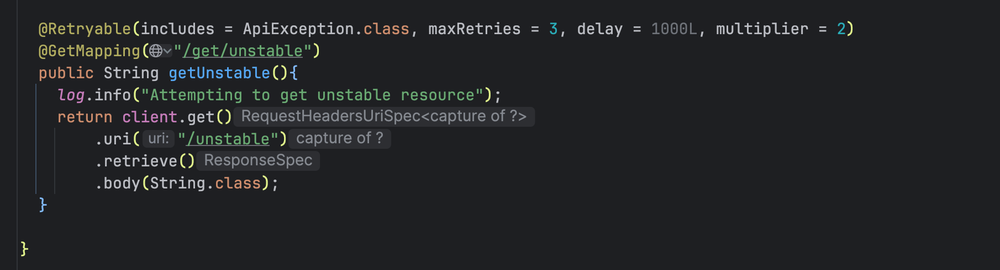

# SPRING BOOT RESTCLIENT ERROR HANDLING

## Tips
Using @Retryable for methods to get retry during http calls

reference: The @Retryable annotation is provided by the Spring Retry library, not the Java language itself, with annotation support introduced in Spring Retry 1.1. While older versions supported Java 8, modern Spring Retry (2.0+) and upcoming native Spring 7 Framework retry features require Java 17 or higher.
SpringSource

### Reference

Video referente -> https://www.youtube.com/watch?v=MuYzEZk6-zI